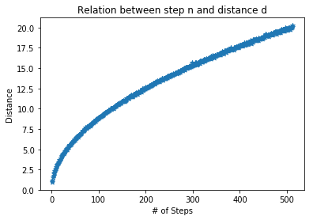
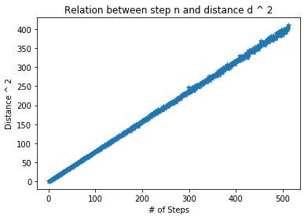
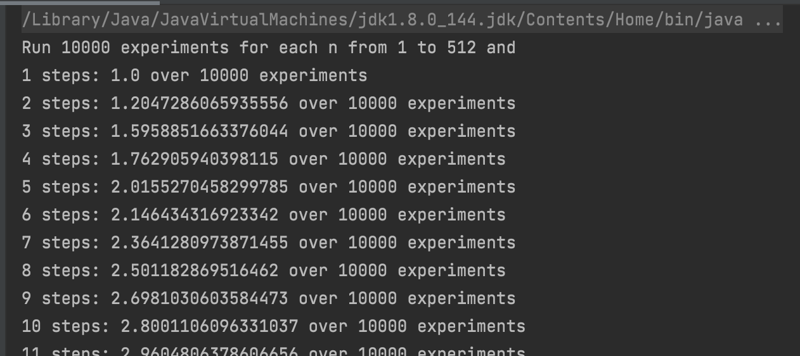
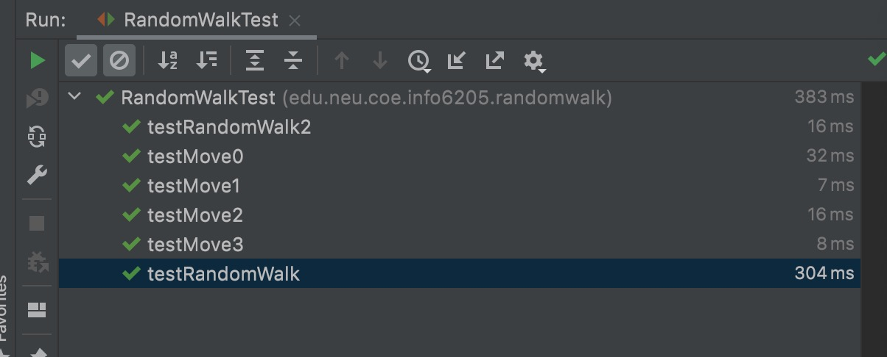

<!--
 * @Author: Caspar
 * @Date: 2021-09-14 18:52:52
 * @Description: file content
-->

# Assignment 1
Random Walk  
Luo Chen   
001564677  

## Conclusion
Let d present the distance and n present the steps. The relation between d and n should be like :   
  
or  
  
where k is slop and b is bias.  
To be specific, the calculated result in my experiment is:  
 

## Evidence
The relation between d and n  
  
The relation between $d^2$ and n  
  
The linear fit result  
  

## Code  
[RandomWalk.java](RandomWalk.java)  for the java code, which will also generate the output data file.  
[data.csv](./data.csv) for the result of my experience.  
[draw_plot.py](./draw_plot.py) for the python code to draw the plots and do linear fit. Python 3.6.8 in my case and requirements.txt for dependency.  

## Terminal Output
 
## Unit Test
 