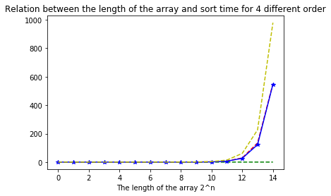
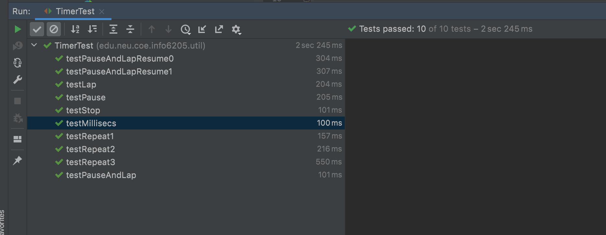
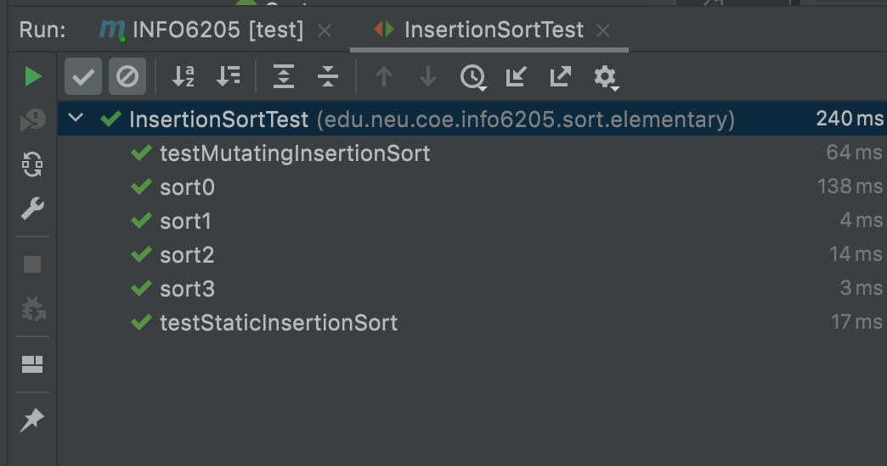

<!--
 * @Author: Caspar
 * @Date: 2021-09-23 14:43:48
 * @Description: file content
-->
# Assignment 2
Benchmark  
Luo Chen   
001564677  

## Conclusion
For part 3:  
The growth of time consumption for different orders  
ordered < random ≈ partially ordered < reverse ordered  
Evidence   
  

## Extra Files   
[data_assignment2.csv](data_assignment2.csv) for the result of my experience.  
[draw_plot.py](./draw_plot.py) for the python code to draw the plots. Python 3.6.8 in my case.  

## Terminal Output  
#### Part 1
 
#### Part 2
 