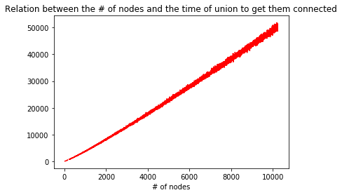
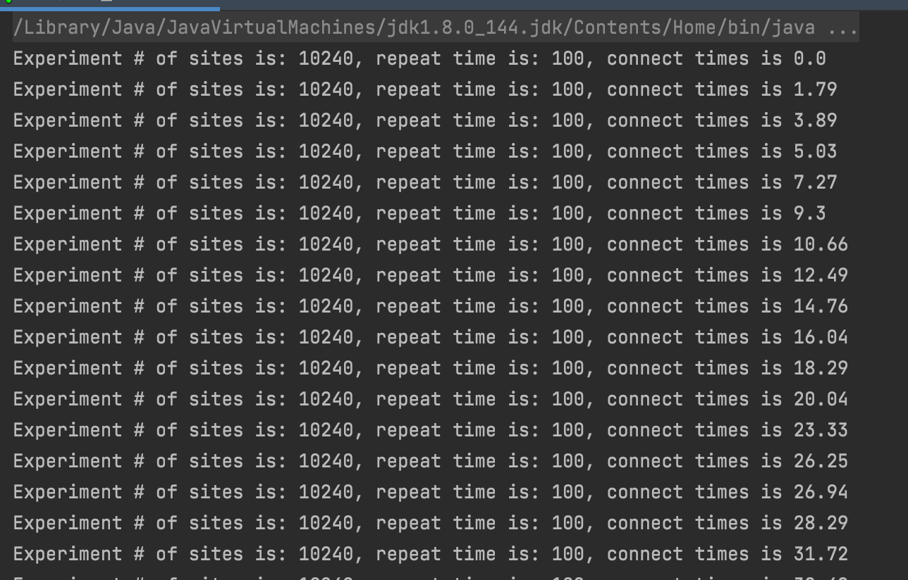

<!--
 * @Author: Caspar
 * @Date: 2021-10-02 13:19:00
 * @Description: file content
-->

# Assignment 3
WQUPC  
Luo Chen   
001564677  

## Conclusion
For part 3:  
The relationship between # of objects (n) and # of pairs (m) generated to connect all objects      

m = kn + b  

where k is the slope, b is bias.

  

## Extra Files   
[data_assignment3.csv](data_assignment3.csv) for the result of my experiment.  
[draw_plot.py](./draw_plot.py) for the python code to draw the plots. Python 3.6.8 in my case.  

## Terminal Output  
#### Part 1
 
#### Part 2
   
