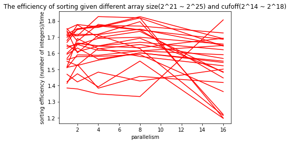
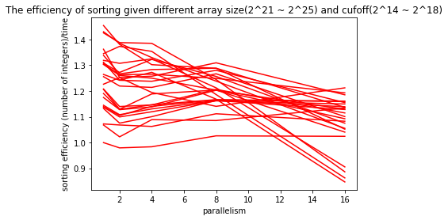
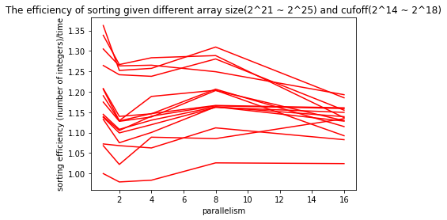
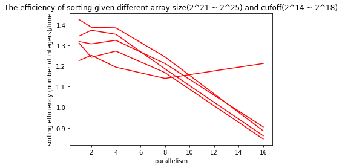
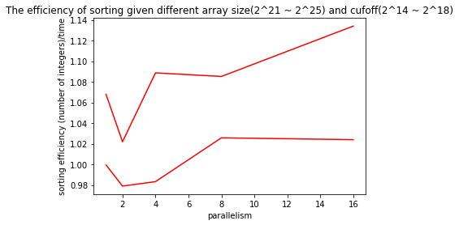
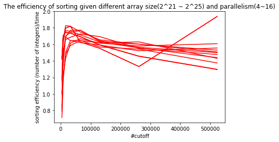
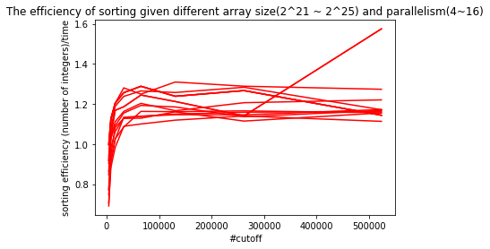
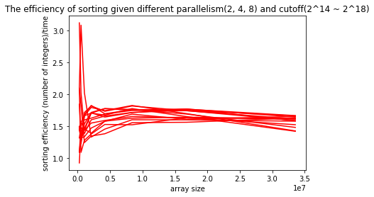
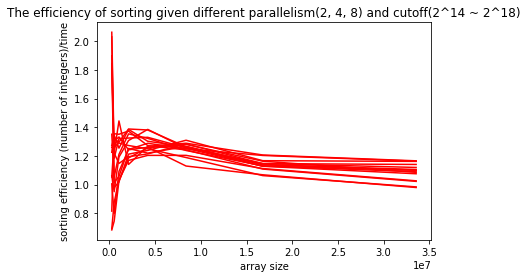

<!--
 * @Author: Caspar
 * @Date: 2021-11-09 16:33:12
 * @Description: file content
-->

# Assignment5  

## Experiments  
### Environment  
The experiments run on the AWS EC2 instances, Amazon Linux 2 AMI.  

- Type: t2.2xlarge  
  - vCPUs: 8 (core == processor == 8)   
  -  Memory: 32G (sufficient enough)
- Type: t2.xlarge   
  - vCPUs: 4 (core == processor == 4)  
  -  Memory: 16G (sufficient enough, unable to choose custom memory)

### Variable Matrix
- array size [2^18, 2^19, 2^20, 2^21, 2^22, 2^23, 2^24, 2^25], from 262144 to 33554432  
- cutoff [2^12, 2^13, 2^14, 2^15, 2^16, 2^17, 2^18, 2^19], from 4096 to 524288  
- parallelism [1, 2, 4, 8, 16]

Experiments have been done with each combination of the three variables and on 2 different instances for 10 time for each.

### Results  
- For vCPUs 8, see [result_8core.csv](result_8core.csv)  
- For vCPUs 4, see [result_4core.csv](result_4core.csv)  
#### Explain for the output  
columns: id, parallelism, cutoff, array size, average time(ms)

## Analysis
### Parallelism  
Compare the situations in two type of instances.   

#### For 8 cores
 
#### For 4 cores
 

The x axis represents for # of parallelism, the y axis represents for sort efficiency(array size / time). Each line represents one combination of size and cutoff.

From data from the instance with 8 cores, we can barely figure out that we have the best performance when parallelism equals to 8. It is understandable that this is a computationally intensive task, so that we can achieve the best efficiency when parallelism is nearly equals to the number of cpu cores given that we have enough memory. 
 
For 4 cores, the best parallelism can be chosen between 8 and 4. It is hard to decide which one is better. In further, we choose different size to do comparison. We don't consider it when parallelism equals to 1 because it would become a single thread method.   

When we select size in [33554432, 16777216, 8388608] and cutoff in [262144, 131072, 65536, 32768, 16384].  
  
We can tell that it performs better when parallelism = 8.  

When we select size in [4194304, 2097152] and cutoff in [262144, 131072, 65536, 32768, 16384].  
  
We can tell that it performs better when parallelism is smaller, when equals to 4 and 2.  

When we select a large size [33554432] and a small cutoff in [32768, 16384].  
   
Seems that we a achieve a better performance when parallelism equals to 16 or even larger! For my understanding, it turns out to be a I/O intensive task so that it works better with more threads.


#### Conclusion for parallelism
In my experiments and given the array size and cutoff, parallelism = 8 might be a good choice for sorting both on the instances with 4 and 8 cores. And when the size of array is much larger than the cutoff, it performs better when we choose larger parallelism even when cpu don't have enough cores.

### Cutoff
#### 8 cores
  
#### 4 cores   
 

The x axis represents for cutoff, the y axis represents for sort efficiency(array size / time). Each line represents one combination of size and parallelism.

It's clear in the first picture for 8 cores that the performance is the best when cutoff is about 50000. Seems that the best cutoff doesn't change with the growth of array size. And for the result of 4 cores cpu, the efficiency is almost the same and cutoff = 50000 won with a small advantage.

#### Conclusion for cutoff

The best cutoff in my experiments is about 50000. And the best value will not increase with the growth of array size. 

### Array size
#### 8 cores
  
#### 4 cores   
 

The x axis represents for array size, the y axis represents for sort efficiency(array size / time). Each line represents one combination of cutoff and parallelism.

There is no big change when array size is greater than 5 * 10^7. We can see a slight decrease after that. It is acceptable that more time will be spend on creating new threads and copying numbers between arrays during parallel merge sorting, which will influence the efficiency of processing each number. It is also worth mentioning that we got a very high value when x is closed to 0. When the size of array is not large enough, we can directly sort an array using Arrays.sort() rather than parallel merge sort. That why we got high efficiency when size is very large.  

#### Conclusion for array size.
The size doesn't matter when it's big enough.

## Code  
### Parameters
- baseParallelism: start value of parallelism
- baseSize: start value of array size
- baseCutOff: start value of cutoff
- stepParallelism: number of parallelisms, 2 times of the original value
- stepSize: start value of array size, 2 times of the original value
- stepCutOff: start value of cutoff, 2 times of the original value

### Define Parameters
Parameters can be defined in pom.xml like this.  
```xml
<configuration>
                    <mainClass>edu.neu.coe.info6205.sort.par.Main</mainClass>
                    <arguments>
                        <argument>-baseParallelism=3</argument>
                        <argument>-stepSize=5</argument>
                    </arguments>
                </configuration>
```

### Run the service
```shell
$ ./mvnw package -Dmaven.test.skip                      # package
$ ./mvnw exec:java -Dexec.cleanupDaemonThreads=false    # run
```
